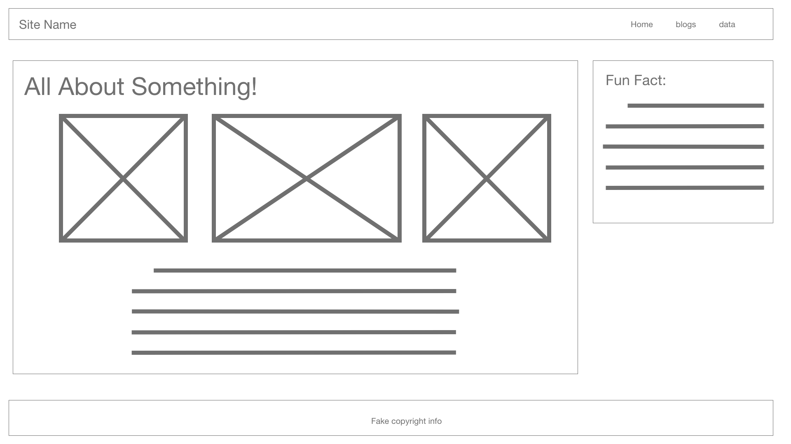
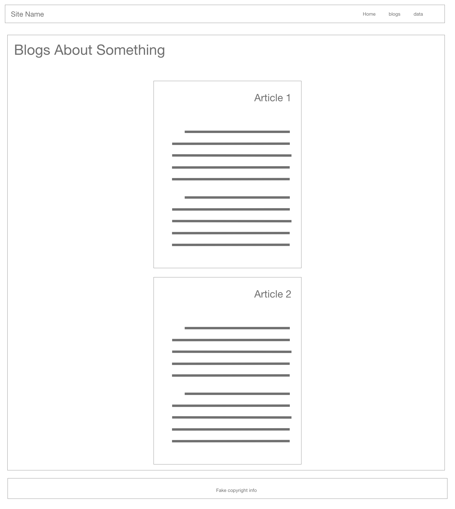
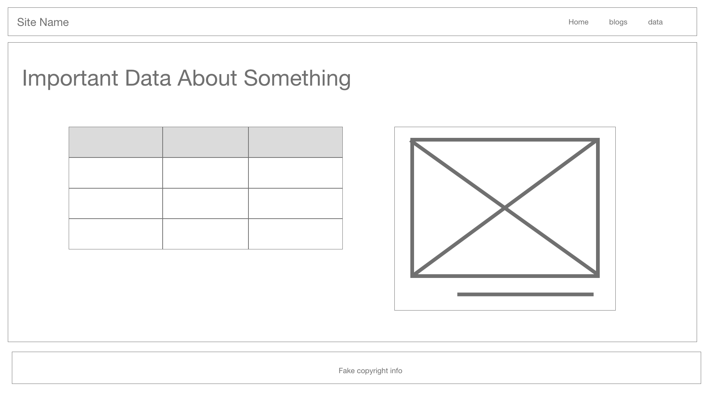
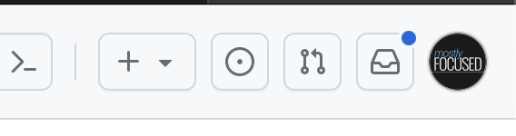
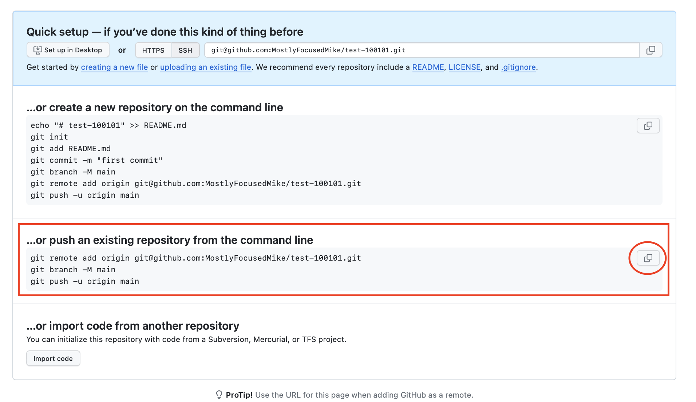

# 2.0.2 Lab - Your First Website!
- [2.0.2 Lab - Your First Website!](#202-lab---your-first-website)
- [Objectives](#objectives)
- [Visualizing the project](#visualizing-the-project)
  - [Mockups](#mockups)
  - [Wire frames](#wire-frames)
- [User stories?](#user-stories)
- [Requirements and mockups](#requirements-and-mockups)
- [Project setup](#project-setup)
  - [Add it to GitHub](#add-it-to-github)
- [Tech Checklist](#tech-checklist)
  - [header](#header)
  - [main](#main)
  - [footer](#footer)
  - [index.html](#indexhtml)
  - [blogs.html](#blogshtml)
  - [data.html](#datahtml)
  - [Styles](#styles)
- [Tips](#tips)
  - [Responsive design?](#responsive-design)
  - [Viewing your work](#viewing-your-work)
  - [CSS](#css)
  - [Flexbox?](#flexbox)
  - [Breaking down the project](#breaking-down-the-project)
  - [Debugging](#debugging)
- [Stretch goals](#stretch-goals)


# Objectives
You're going to build a site about...whatever you want! It's up to you, whatever topic you like (remember, keep it appropriate for school) is allowed. All we're going to give you are some basic requirements, the content is all you.

Now, obviously your site won't be very *complicated*, since you're going to be doing it all of this by hand. But it's important for you to understand the fundamentals, so later on when you have more powerful tools, you don't shoot yourself in the foot.

> The goal of this project is to show you the fundamentals of building a website. As a bonus, you can even deploy it!


# Visualizing the project
Sometimes it can be helpful when building to see things visually. With webdev, there are 2 main ways to show a site blueprint: mockups and wire frames.

## Mockups
These are probably what you're thinking of by default: fully rendered images of what your site will look like. Maybe not finalized, but things like colors, images, and fonts are all close to what they'll be in the final product.

These are better for later stages of the project.

## Wire frames
*These* are what we'll be working from today. Wire frames are very aptly named: they're just wires (lines) and frames (empty shapes). These convey the structure of the site, but not the content. They are meant to be generated quickly so you can actually spend time building the site.

# User stories?
So we used "User Stories" in our previous labs because they were interactive. However, for more "static" (that means "unchanging," it's the opposite of "dynamic") projects, sometimes it's more helpful to list things out with pictures and requirements. Remember, there are *many* project planning tools, think about which make sense and use anything you need. Later on, we'll use visuals, checkpoints, *and* user stories!

# Requirements and mockups
You'll make 3 pages:
- index.html
  - This will be the home page of your site.
- blogs.html
  - This page will feature some articles about your topic (the bodies of these articles can absolutely be gibberish).
- data.html
  - This page will feature some data about your topic featuring a table and a figure!

And on each one of those pages will be a:
- header
  - featuring the title of your site, and a navigation bar linking to the other pages
- main
  - featuring the main content of the page
- footer
  - featuring some fake copyright info (or honestly whatever you want)

Here are the mockups for each:
`index.html`


`blogs.html`


`data.html`


# Project setup
Create a new directory called `2-0-2-lab_first-site` and inside of it, create the following files and directories:

```plaintext
- index.html
- blogs.html
- data.html
- css/
  ↳ style.css # You may want more than one style sheet
- images/
  # You may not have the images to start, that's ok add them later!
  ↳ [first square image]
  ↳ [second square image]
```

Then run `git init` to initialize a new git repository. Commit all your initial files:

```bash
git add .
git commit -m "initial commit"
```

## Add it to GitHub
Ok, now that's set, head over to GitHub, and create a new repository. On the site in the top corner click the `+` and select `New repository`.



Give it the name `2-0-2-lab_first-site`, skip all the "initialize with" stuff, and click `Create repository`. If you accidentally initialize it with a README, just start over with a new blank repo (modify the name slightly, or delete the messed up repo).

Once you click `Create Repository` in the bottom, you'll see this page:



**You want to copy the code under the "push" option**

Take that code and paste it into the repo you just made in your terminal. After the pasted commands finish running, go back to that browser page that had the commands and refresh the page. Voila! Your code is now on GitHub! You can update this by committing and pushing up your code to GitHub.

# Tech Checklist
Here are the specific things we're looking for on each page. If you can check all these off with your project, you're in great shape! If something confuses you, good! That's an opportunity to learn and once you get it, it's proof you grew! There are some things here you may not have seen and that's ok, we've included some links to help get you started.

Lets start with the universal elements that should appear on each page:

## header
- [ ] Has a `header` elements at the top of each page
- [ ] Inside the header is a `p` tag with the site name
- [ ] Inside the header is a `nav` tag with 3 `a` tags inside of it
  - [ ] The first `a` tag has the text "Home" and links to `index.html`
  - [ ] The second `a` tag has the text "Blogs" and links to `blogs.html`
  - [ ] The third `a` tag has the text "Data" and links to `data.html`
- [ ] The links appear in a `ol` and each one is in an `li` element
- [ ] The links all appear on the same line
- [ ] The `nav` is over to the right of the `header`

Never made a nav? Check out this great [W3schools tutorial](https://www.w3schools.com/css/css_navbar.asp)!

## main
- [ ] Has a `main` element on each page with the main content
- [ ] Each page has only a single `h1` tag either as a child or grandchild

## footer
- [ ] Has a `footer` element at the bottom of each page
- [ ] Inside the footer is a `p` tag with the text "© 2021 - Your Name"
- [ ] The footer takes the entire width of the page
- [ ] The `p` tag text is centered on the page

Alright, now lets look at each individual page:

## index.html
- [ ] There is a `section` on the page
- [ ] The section is `aria` labelled by the `h1`
- [ ] There are 3 images in the section
- [ ] The 2 square images on the side are *local* and in your project
- [ ] The center image is *remote* and links to an image on the internet and is a rectangle
- [ ] Under the images is at least 1 `p` tag with text explaining your topic
- [ ] To the right of the section is an `aside` element
- [ ] The aside has a `h2` tag
- [ ] There is at least 1 `p` tag with text in the `aside` element

Don't panic about that `aria` part with `sections`, watch this [video that explains properly labelled sections](https://www.youtube.com/watch?v=ULdkpU51hTQ).

## blogs.html
- [ ] There are at least 2 `article` elements on the page
- [ ] Each `article` has a `h2` tag
- [ ] Each `article` has at least 2 `p` tags with text (can be gibberish)
- [ ] Each `article` is horizontally centered on the page

Check out the [lorem ipsum VSCode plugin to generate fake text](https://marketplace.visualstudio.com/items?itemName=Tyriar.lorem-ipsum)

## data.html
- [ ] There is a `table` element on the page
- [ ] The table has at least headers, 3 columns and 2 rows (3 if you include headings row)
- [ ] The table data makes sense for your topic
- [ ] There is a `figure` element on the page
- [ ] The figure has a `img` tag with a remote image
- [ ] The img has an `alt` attribute
- [ ] The figure has a `figcaption` with a caption for the image
- [ ] The table and figure are next to each other, and together they are centered on the page

We've never built a table together before, but here's a [W3schools tutorial](https://www.w3schools.com/html/html_tables.asp)! Don't be intimidated by them, if you write your HTML neatly, tables are no big deal. As for figures and captions, check out this [W3schools tutorial](https://www.w3schools.com/tags/tag_figure.asp).

## Styles
- [ ] All pages have linked styles
- [ ] Each page's header and footer look *exactly* the same
- [ ] The overall styles are consistent across all pages (as in each page looks like it goes with the others)

# Tips
The above is all you need to get going, be creative as you want, just hit the minimums. If you need some help, here are some tips:

## Responsive design?
This is super important and means that a site looks good on *any* screen size. We aren't worried about that *just* yet. We're optimizing our site for desktops with those mockups. However, after you finish with our requirements, feel free to make your site responsive! It doesn't take much, as you will see.

## Viewing your work
Remember, you can either do `open index.html` in the command line, *or* use VSCode's LiveServer plugin to host your site locally. Either one is good, just make sure that you can see your work!

## CSS
Did you remember to *add* your css file(s) to each of your pages? Don't forget this critical step!

## Flexbox?
Everything on these pages can be done without it, but you may see tutorials talking about "Flexbox" or "CSS Grid." Both are *super* useful layout tools, and you'll learn about them next week. If you want to use them, go for it! If you don't, that's fine too! We want to make sure you understand the `display` property first, with `inline` vs `block` elements.

## Breaking down the project
If you don't know where to begin, the `index.html` is as good a place as any. Once you get the `header` and `footer` looking nice, then you can copy them into the other pages. Then we recommend you check out the `data.html` because it's a little tougher. In general when doing a project, you'll want to knock out the more unknown aspects first. In this case, it's that `table` element. Get that, and then the toughest part of the project is over!

## Debugging
CSS and HTML can be a really *tedious* thing to do by hand, so move slowly and always be checking (ABC) your code. Just because this isn't JS and there are no automated tests doesn't mean you can't *manually* check your work. In fact, manually testing your work is called "QAing" (Quality Assurance...ing). So QA your work!

# Stretch goals
Once you get your site working, you might want to share it with the world! Well, to do that you'll need what's called a "static server." That is to say, a very simple server that knows how to "host" (show) your pages to the world. Luckily, GitHub itself has a feature called GitHub Pages that does just that! Check out [this tutorial on using GitHub Pages](https://docs.github.com/en/pages/quickstart) to learn how to set it up. It's only a few steps!

Also, the wire frames we've given are the *minimum* requirements, after you deploy, feel free to add as much to your site as you want. Have fun and stay curious!

